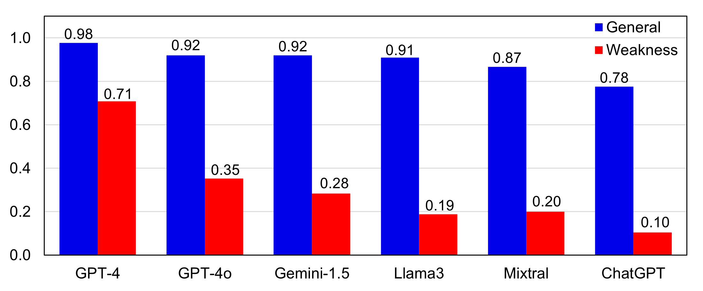

# LogicAsker: Evaluating and Improving the Logical Reasoning Ability of Large Language Models

This is the artifact for the paper ["LogicAsker: Evaluating and Improving the Logical Reasoning Ability of
Large Language Models"](https://arxiv.org/abs/2401.00757). This artifact supplies the LogicAsker toolkit and supplementary materials for the paper. This repository contains:

1. Code implementation and utilities of LogicAsker, i.e., the python script and instructions to run LogicAsker to test LLMs specified in the paper.
2. Generated dataset. We present a sample of 5.2k generated data that we used in our experiment in `data/.` A training dataset of size 10.4k is available on [Huggingface 🤗](https://huggingface.co/datasets/iforgott/LogicAsker).

**Quick Links**

[Abstract](#Abstract) | [Insights](#Insights) | [Dataset 🤗](https://huggingface.co/datasets/iforgott/LogicAsker) | [Code Usage](#Code)


# Abstract

We introduce LogicAsker, a novel approach for evaluating and enhancing the logical reasoning capabilities of large language models (LLMs) such as ChatGPT and GPT-4. Despite LLMs' prowess in tasks like writing assistance, code generation, and machine translation, assessing their ability to reason has been challenging. Traditional evaluations often prioritize accuracy on downstream tasks over direct assessments of reasoning processes. LogicAsker addresses this gap by employing a set of atomic reasoning skills grounded in propositional and predicate logic to systematically examine and improve the reasoning prowess of LLMs. Our methodology reveals significant gaps in LLMs' learning of logical rules, with identified reasoning failures ranging from 29% to 90% across different models. Moreover, we leverage these findings to construct targeted demonstration examples and fine-tune data, notably enhancing logical reasoning in models like GPT-4o by up to 5%. To our knowledge, this is the first effort to utilize test case outcomes to effectively refine LLMs' formal reasoning capabilities.


# Insights

**LogicAsker can effectively expose logical failures in the first iteration. When focusing on the weak skills of LLMs in the second iteration, we further reduce the accuracy of the LLMs.** 



**Most LLMs are better at easier logical skills such as propositional logic.**


**Most LLMs are weak in recognizing logical fallacies.**


# Code

## Install environment 

Please install the required modules by using `./init.sh env`.

## Generating data

Example code for generating data is available in `./generate_data.ipynb`.

To generate $n$ pieces of quiries, with problem categories being "inference", "contradiction", or "unrelated", and with inference length $l$, using specific list of rules, please use the following code:

```
from LogicAsker import gen_cases
gen_cases(n, category, length=l, rules=rules)
```

To generate $n$ pieces of enquiries, with problem categories being "inference", "contradiction", or "unrelated", and with inference length $l$, using specific list of fallacies and rules, please use the following code:

```
gen_cases(n, category, l, fallacies)
```

## Query an LLM

You can conduct experiment with our sample data or self generated data on a particular LLM specified in our paper. An example to test GPT4 using sample data and save the question-answer pairs as "example.csv" is as follows. Note that to connect to OpenAI API, you need to first store your API key in a txt file and provide the path to the key file as a parameter:

```
from LogicAsker import do_experiment
import pandas as pd

data = pd.read_csv("./data/dataframe_exp1.csv")
do_experiment(data, "gpt4", key_path="KEYPATH/key.txt", exp_name="example")
```

### Calculating Statistics/Weakness

After obtaining question-answer pairs of an LLM, we can calculate the accuracy of the LLM on each rules and identify the top k weakness rules by the following code:

```
from LogicAsker import get_stat, get_weakness
import pandas as pd

data = pd.read_csv("example.csv") # load question-answer pairs
stat = get_stat(data) # a dataframe containing the accuracy of the LLM on each rules
weakness = get_weakness(stat, k) # return a list of k rule names that has the lowest accuracies 
```

### Generating ICL Prompts

This is a code example to generate ICL prompts with problem categories being "inference", "contradiction", or "unrelated", with inference length $l$, using specific list of rules or fallacies:

```
from LogicAsker import gen_prompt

gen_prompt(category=category, rule=rules) # normal rules
gen_prompt(category=category, rule=rules, fallacy=fallacies, length=l) # fallacy rules
```


## Testing Customized LLM

Use LogicAsker to test customized LLMs in just two steps:

- Create a class in `script/apis.py` that inherit from the *Bot* class, and overwrite the *query* method where the input is a query (string) and the output is yourLLM's answer (string) to that query.

- Update the *BOT_DICT* in `LogicAsker.py` to include your LLM class.

  
